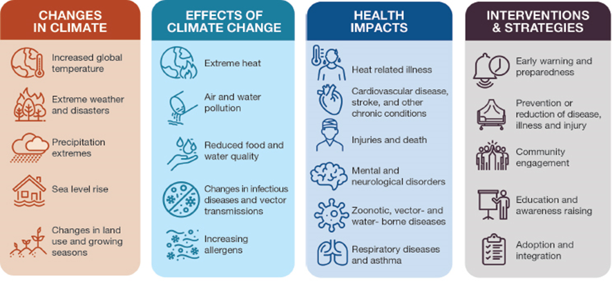
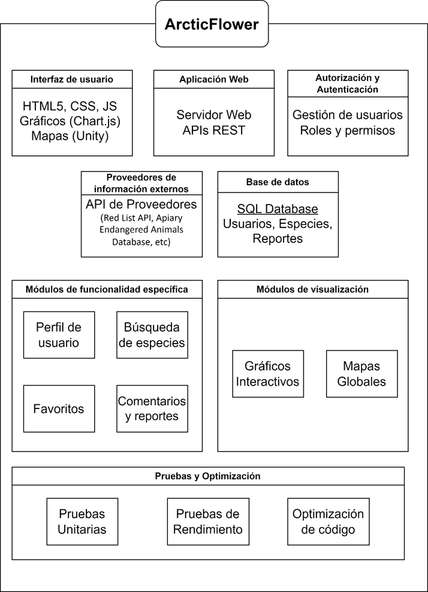
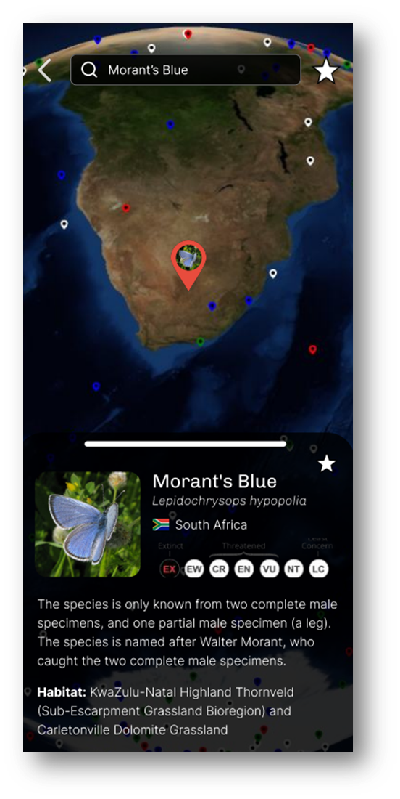

Ignacio Marzotta Diaz
Proyecto de título
Facultad de Ingeniería, Universidad Andrés Bello

<h1>ArcticFlower</h1>

<h2>Introduccion</h2>
 
El cambio climático y la pérdida de biodiversidad son dos de los mayores desafíos que enfrenta la humanidad en el siglo XXI. Según el "Global Assessment Report on Biodiversity and Ecosystem Services" de 2019, alrededor de un millón de especies están en peligro de extinción debido a las actividades humanas como la deforestación, la contaminación y el cambio climático. La necesidad de educar y concienciar al público sobre estos problemas es más urgente que nunca, y las redes sociales están jugando un rol fundamental en cambiar la percepción pública sobre esta crisis, por lo que educarse e informarse es más urgente que nunca.

En este contexto nace ArcticFlower, un proyecto sin fines de lucro diseñado para proporcionar una plataforma interactiva y educativa que informe sobre las especies en peligro de extinción y los impactos del cambio climático. Utilizando tecnologías web modernas y datos de fuentes confiables, ArcticFlower busca no solo informar, sino también inspirar a las personas a tomar acciones concretas para proteger nuestro planeta. El proyecto se centrará en ofrecer una experiencia accesible y atractiva tanto para el público general como para educadores y organizaciones ambientales, destacando la importancia de cada pequeña acción en la lucha contra la pérdida de biodiversidad.

<h2>Características: </h2>

* Catálogo de especies: El software proporcionará un extenso catálogo de especies en peligro de extinción y en riesgo, con información detallada sobre su hábitat, características, amenazas y estado de conservación.

* Exploración interactiva: Los usuarios podrán explorar de manera interactiva mapas geográficos y ecosistemas virtuales para aprender sobre la distribución geográfica de las especies y las amenazas a las que se enfrentan.

* Herramientas de sensibilización: Se incluirán herramientas de sensibilización como vídeos educativos, infografías animadas y juegos interactivos para comunicar de manera efectiva la importancia de la biodiversidad y las acciones que se pueden tomar para su conservación.

* Participación comunitaria: ArcticFlower facilitará la participación comunitaria mediante funciones de reporte de avistamientos de especies, comentarios y contribuciones de contenido por parte de los usuarios, fomentando así la colaboración y el compromiso con la conservación.

* Actualizaciones y notificaciones: El software proporcionará actualizaciones periódicas sobre el estado de conservación de las especies, noticias relevantes sobre la biodiversidad y notificaciones sobre eventos y oportunidades de participación en actividades de conservación.

<h2>Esquema de componentes: </h2>

<h2>Boceto: </h2>

